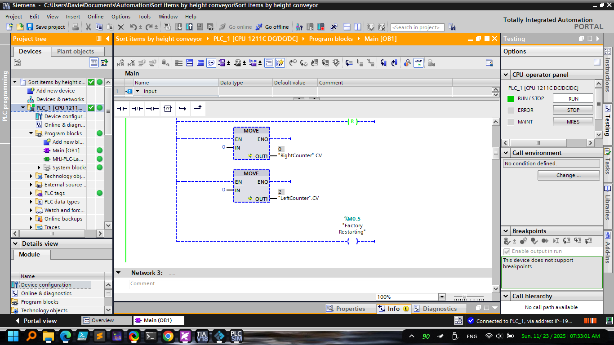
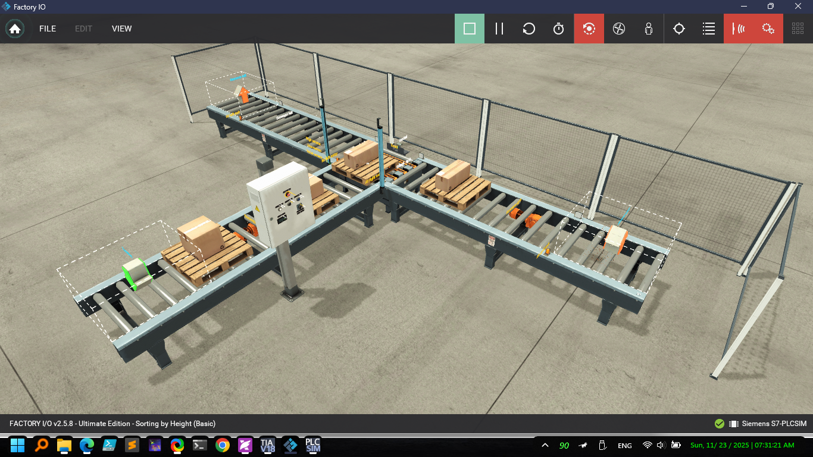

# Sort Items by Height Conveyor 

Factory IO visualizes the conveyor while Siemens TIA Portal (v18) runs the control logic. Parts enter the line, are measured, and then diverted to the correct drop lane based on height. This repo stores both the PLC program and the Factory IO scene so you can study or reuse the project end-to-end.

*TIA Portal v18 project showing the PLC program used to run the sorter.*

*Factory IO 3D scene with the conveyor, sensors, and diverter actuators mapped to the PLC.*

## Highlights
- Fully configured TIA Portal project (`Sort items by height conveyor.ap18`) with tags, PLC blocks, and HMI screens.
- Factory IO scene (`My Scenes/height sort.factoryio`) wired to the PLC via OPC UA/S7.
- Recipe-driven height thresholds so you can retune sorting rules without touching ladder/FBD code.
- Buffer monitoring, jam detection, and alarms logged under `Logs/`.

## Repository Layout
- `Sort items by height conveyor.ap18` – main Siemens TIA Portal project archive.
- `My Scenes/height sort.factoryio` – Factory IO scene used for the 3D visualization.
- `media/` – reference screenshots for quick understanding of the setup.
- `System/`, `IM/`, `Vci/`, etc. – generated support files from TIA Portal (leave them intact).
- `AdditionalFiles/PLCM/` – PLCM archive for portability between engineering stations.

## Requirements
1. Siemens TIA Portal V18 (project was upgraded from V15; conversion logs are under `Logs/`).
2. Factory IO 2.x with the Siemens S7-1200 driver.
3. Optional: PLCSIM Advanced if you do not have physical hardware.

## Getting Started
### 1. Restore the PLC project
1. Open TIA Portal V18.
2. Use **Project > Retrieve** and select `Sort items by height conveyor.ap18`.
3. Compile the PLC and HMI devices; resolve any missing hardware targets if you are using a different CPU.

### 2. Launch the simulation
1. Open Factory IO and load `My Scenes/height sort.factoryio`.
2. Configure the driver to **Siemens S7-1500 (S7-1500 / PLCSIM)** and map the listed tags to the PLC.
3. Press **Play** to start the 3D scene; the PLC program now drives the conveyor and actuators.

### 3. Run & monitor
- Start the PLC (real hardware or PLCSIM Advanced).
- Use the HMI screens to start/stop the line, view sensor states, and adjust height bands.
- Observe the physical routing in Factory IO; every part should be diverted based on its measured height.

## Control Logic Overview
- **Measurement** – an analog sensor captures height, normalized in a dedicated PLC FB.
- **Decision** – compares the height against `HeightLow` / `HeightHigh` thresholds to select the lane.
- **Actuation** – timed DO pulses energize the diverter cylinders while interlocks ensure only one diverter fires at a time.
- **Diagnostics** – watchdog timers and jam detection bits trigger alarms and light the HMI indicators.

## Tips
- If you change tag names or addresses, update both the PLC project and the Factory IO driver map.
- Keep backups of the `.ap18` and `.factoryio` files before experimenting.
- Use `Logs/ConversionLog_15.0.0.0_to_18.0.1.0.xml` to track any differences if you downgrade/upgrade the project again.

## License
No explicit license is provided; assume internal or educational use only unless clarified by the owner.
